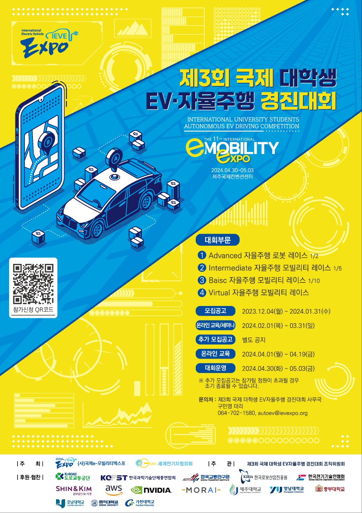
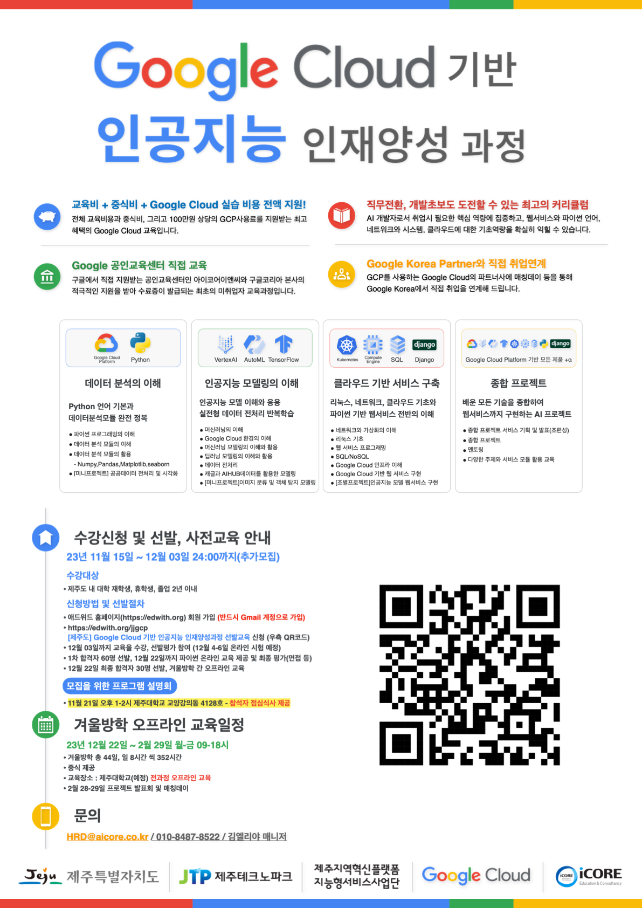

## C# 프로그래밍
* 2022학년도 C# 프로그래밍 강의 깃허브입니다.

## C# 오픈소스 검색 및 분석 제출
* GitHub 혹은 Kaggle 등에서 소스를 찾은 경우 -> 간단 보고서에 링크를 넣어서 "이름_학과_학번_간단제목".pdf 파일을 이메일(yungcheolbyun@gmail.com)로 보냄!!!
* 소스코드가 따로 있을 경우에는 보고서를 '실행할 수 있는 소스코드'와 함께 압축하여 ZIP 파일을 이메일(yungcheolbyun@gmail.com)로 보냄!!!
* 모든 학생이 새로 보내세요.

### 자율주행 자동차 경진대회 참여 혜택
* 참여하는 학생들에게는 1천만원 상당의 자율주행 자동차를 구입하여 사용할 수 있도록 지원
* 1인당 장학금 40만원 추가로 지급 예정 


### 구글 클라우드 특강 혜택
* 제주대학교 졸업 2년 이내 학생에게는 혁신인재지원금 50만원 지급  -> 수료 후 일괄지급 
* 전체 수강자 중 3명 선발하여 미국 구글 본사 방문 (예정으로 아직 확정되지 않음)
* 전체 수강자 중 10명 선발하여 상장과 부상 수여
* 제주대학교 재학생 중 3명 선발하여 실리콘벨리 기업 방문, 해외 연수 우선 선발 (2024년도 진행) 


## RIS 지능형서비스사업단 설문조사 (아래 링크 클릭)
http://naver.me/59ijR7PO

### C# 동영상 강의 리스트
* 1장.C# 프로그래밍을 위한 OOP 기본(1/2), https://youtu.be/CcaYVcEXM3w
* 1장.C# 프로그래밍을 위한 OOP 기본(2/2), https://youtu.be/7G7t-mBWvSw
* 2장.추상화에서 OOP까지(1/2), https://youtu.be/5mm5i3LSBhQ
* 2장.추상화에서 OOP까지(2/2), https://youtu.be/mWNfrqaDqSw
* 3장.C# 프로그래밍에 익숙해지기(1/2), https://youtu.be/Edids3QVyuM
* 3장.C# 프로그래밍에 익숙해지기(2/2), https://youtu.be/qFM07_2JlaA
* 4장.상속으로 코드 재사용하기(1/3), https://youtu.be/K5LDYRxlM-c
* 4장.상속으로 코드 재사용하기(2/3), https://youtu.be/t4nRg7Dr53g
* 4장.상속으로 코드 재사용하기(3/3), https://youtu.be/wKzyccZqpMs
* 5장.닷넷 프레임워크와 어셈블리(1/4), https://youtu.be/pNEVa2rH0hE
* 5장.닷넷 프레임워크와 어셈블리(2/4), https://youtu.be/vOobfWEgbE8
* 5장.닷넷 프레임워크와 어셈블리(3/4), https://youtu.be/4Ut_IGVUchs
* 5장.닷넷 프레임워크와 어셈블리(4/4), https://youtu.be/vr_yhgF9lXI
* 6장.델리게이트(1/9), https://youtu.be/Y2DOtM7Zpok
* 6장.델리게이트(2/9), https://youtu.be/USQ7wmUR8JI
* 6장.델리게이트(3/9), https://youtu.be/6hc3UXt0Ezs
* 6장.델리게이트(4/9), https://youtu.be/L30uhR5Mx7k
* 6장.델리게이트(5/9), https://youtu.be/VqHw375n-mk
* 6장.델리게이트(6/9), https://youtu.be/eGAC9o_X_2U
* 장.델리게이트(7/9), https://youtu.be/zjd2XNYSONg
* 6장.델리게이트(8/9), https://youtu.be/zXC4EFyORcE
* 6장.델리게이트(9/9), https://youtu.be/T1tphuseiBw
* 7장.마술사 이용 연습(1/3), https://youtu.be/2L58O5y6GTs
* 7장.마술사 이용 연습(2/3), https://youtu.be/u7_0iH1kEeo
* 7장.마술사 이용 연습(3/3), https://youtu.be/acybJoMFz30
* 8장.모듈과 라이브러리(1/3), https://youtu.be/hqmCchQlwbM
* 8장.모듈과 라이브러리(2/3), https://youtu.be/wrTYVL4-HeE
* 8장.모듈과 라이브러리(3/3), https://youtu.be/ldIjaNwgW4s
* 9장.메모 프로그램(1/2), https://youtu.be/1kgJtMQfkOY
* 9장.메모 프로그램(2/2), https://youtu.be/AriOBnPadL0

### [Code 1] 아래 C++ 프로그램을 C# 프로그램으로 바꿔보세요.
```
#include <stdio.h>

class XXX 
{
private:
    int iX; 
    int iY; 

public:
    void Assign(int x, int y) {
        iX = x;
        iY = y;
    }

    int Add() {
        return iX + iY;
    }
};

XXX gildong;

void main() 
{
    gildong.Assign(2, 3);

    int iResult = gildong.Add();

    printf("두 개의 값을 더한 결과 : %d\n", iResult);
}
```

### [Code 2] 다음 코드에서 Click은 xxx 함수 대신 사용하는 델리게이트이다. 델리게이트 Click을 사용할 수 있도록 코드를 적절히 수정하세요. 
```
using System;

public class Base
{
        //여기에 코드 작성
	public void xxx()
	{
		Console.WriteLine("클릭!");
	}
}
public class Delegate
{
	public static void Main()
	{
		Base gildong = new Base();
		gildong.Click(); //Click은 xxx 함수 대신 사용하는 델리게이트
	}
}
```


